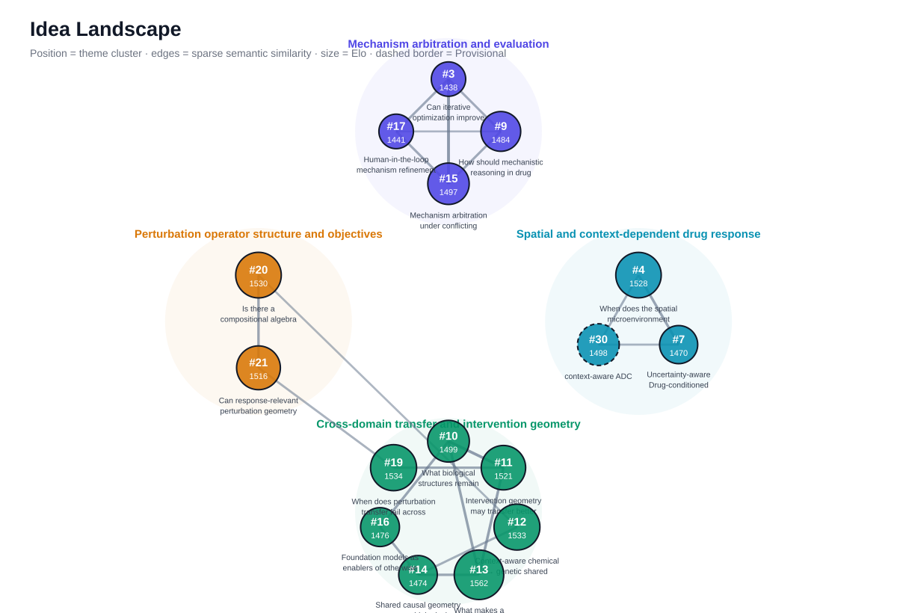

# Research Ideas

A lightweight repository for capturing, developing, comparing, and evaluating research ideas.

The goal is to **store ideas early, sharpen them into falsifiable questions, compare alternatives explicitly, and progressively invest in the best ones** rather than waiting until an idea is fully formed.

The structure is inspired by Michael A. Fischbach's framework for problem choice and decision trees in science and engineering.

<!-- RESEARCH_ELO_START -->
## Research Elo

Relative LLM-judge ranking of open research ideas. Ratings are comparative feedback, **not an objective measure of scientific value**.

- Ratings within **20 points** are shown as approximate ties.
- Issues remain **Provisional** until they have at least **10 games**.
- **Δ7d** compares the current rating with the latest stored snapshot at least 7 days old; it shows **—** until enough history exists.
- **Opp.** is the number of distinct opponents an issue has faced.
- Small rating changes should not be interpreted as meaningful differences in scientific quality.

| Rank | Issue | Rating | Δ7d | Games | Opp. | Status | Record |
|---:|---|---:|---:|---:|---:|---|---:|
| ≈1 | [#34 — \[Idea\] CTD: Evidence Sufficiency and Selective Abstention](https://github.com/inoue0426/research_ideas/issues/34) | **1667** | — | 20 | 19 | 🟢 Established | 19W / 0D / 1L |
| ≈1 | [#33 — \[Idea\] Multi-Agent Uncertainty and Abstention for Biomedical Drug Reasoning](https://github.com/inoue0426/research_ideas/issues/33) | **1654** | — | 19 | 19 | 🟢 Established | 18W / 0D / 1L |
| 3 | [#32 — \[Idea\] Frontier-Conditioned Molecular Generation with Large Language Models](https://github.com/inoue0426/research_ideas/issues/32) | **1641** | — | 19 | 18 | 🟢 Established | 17W / 0D / 2L |
| 4 | [#31 — \[Idea\] Reliable Biomedical Evidence Reasoning: Separating Evidence Selection from Evidence Sufficiency](https://github.com/inoue0426/research_ideas/issues/31) | **1595** | — | 19 | 19 | 🟢 Established | 15W / 0D / 4L |
| ≈5 | [#19 — \[Idea\] When does perturbation transfer fail across biological domains?](https://github.com/inoue0426/research_ideas/issues/19) | **1564** | — | 19 | 19 | 🟢 Established | 13W / 0D / 6L |
| ≈5 | [#20 — \[Idea\] Is there a compositional algebra of biological perturbations?](https://github.com/inoue0426/research_ideas/issues/20) | **1554** | — | 19 | 19 | 🟢 Established | 13W / 0D / 6L |
| ≈5 | [#30 — \[Idea\] context-aware ADC](https://github.com/inoue0426/research_ideas/issues/30) | **1547** | — | 20 | 19 | 🟢 Established | 13W / 0D / 7L |
| ≈8 | [#21 — \[Idea\] Can response-relevant perturbation geometry be separated from mechanistically faithful perturbation geometry?](https://github.com/inoue0426/research_ideas/issues/21) | **1540** | — | 24 | 19 | 🟢 Established | 14W / 0D / 10L |
| ≈8 | [#16 — \[Idea\] Foundation models as enablers of otherwise impossible cross-domain translation](https://github.com/inoue0426/research_ideas/issues/16) | **1533** | — | 20 | 19 | 🟢 Established | 12W / 0D / 8L |
| ≈10 | [#12 — \[Idea\] Context-aware chemical ↔ genetic shared perturbation space](https://github.com/inoue0426/research_ideas/issues/12) | **1504** | — | 20 | 19 | 🟢 Established | 10W / 0D / 10L |
| ≈10 | [#15 — \[Idea\] Mechanism arbitration under conflicting evidence](https://github.com/inoue0426/research_ideas/issues/15) | **1498** | — | 20 | 19 | 🟢 Established | 10W / 0D / 10L |
| ≈12 | [#13 — \[Idea\] What makes a representation preserve intervention geometry?](https://github.com/inoue0426/research_ideas/issues/13) | **1461** | — | 20 | 19 | 🟢 Established | 8W / 0D / 12L |
| ≈12 | [#14 — \[Idea\] Shared causal geometry across biological modalities](https://github.com/inoue0426/research_ideas/issues/14) | **1461** | — | 19 | 19 | 🟢 Established | 8W / 0D / 11L |
| ≈14 | [#4 — \[Idea\] When does the spatial microenvironment override cell-intrinsic drug sensitivity?](https://github.com/inoue0426/research_ideas/issues/4) | **1438** | — | 19 | 19 | 🟢 Established | 6W / 0D / 13L |
| ≈14 | [#9 — \[Idea\] How should mechanistic reasoning in drug response be evaluated when multiple explanations may be valid?](https://github.com/inoue0426/research_ideas/issues/9) | **1431** | — | 23 | 19 | 🟢 Established | 7W / 0D / 16L |
| ≈16 | [#11 — \[Idea\] Intervention geometry may transfer better than state geometry](https://github.com/inoue0426/research_ideas/issues/11) | **1410** | — | 19 | 19 | 🟢 Established | 5W / 0D / 14L |
| ≈16 | [#10 — \[Idea\] What biological structures remain transferable across domain shifts?](https://github.com/inoue0426/research_ideas/issues/10) | **1395** | — | 20 | 19 | 🟢 Established | 4W / 0D / 16L |
| ≈16 | [#7 — \[Idea\] Uncertainty-aware Drug-conditioned spatial INR](https://github.com/inoue0426/research_ideas/issues/7) | **1391** | — | 20 | 18 | 🟢 Established | 4W / 0D / 16L |
| ≈16 | [#3 — \[Idea\] Can iterative optimization improve mechanism arbitration under conflicting evidence?](https://github.com/inoue0426/research_ideas/issues/3) | **1391** | — | 21 | 19 | 🟢 Established | 4W / 0D / 17L |
| 20 | [#17 — \[Idea\] Human-in-the-loop mechanism refinement](https://github.com/inoue0426/research_ideas/issues/17) | **1325** | — | 22 | 19 | 🟢 Established | 1W / 0D / 21L |

_Updated automatically by Research Elo workflows. Last update: 2026-08-25 18:39 UTC._
<!-- RESEARCH_ELO_END -->

<!-- RESEARCH_MAPS_START -->
## Research Maps

A compact overview is kept here; the full exploration views live on GitHub Pages.

- 🗺️ [Idea Landscape](https://inoue0426.github.io/research_ideas/idea_landscape.html) — semantic similarity and theme clusters
- 🧭 [Research Program Graph](https://inoue0426.github.io/research_ideas/research_programs.html) — typed research relationships

_Current themes: Mechanism arbitration and evaluation, Spatial and context-dependent drug response, Cross-domain transfer and intervention geometry, Perturbation operator structure and objectives. Typed program relations: 9. Maps are organizational aids, not measures of scientific importance._
<!-- RESEARCH_MAPS_END -->

## Language

Use whichever language helps you think most precisely. The templates are written in English because research questions, literature searches, papers, and collaborations are often conducted in English, but issue responses may be written in Japanese, English, or a mixture of both. Prefer clarity of reasoning over forced translation.

A useful default is:

- **Think and capture in the fastest language** when an idea is fragile or incomplete.
- **Rewrite the one-sentence research question and key claims in English** before deep evaluation, so they can be compared directly with the literature and reused in papers or discussions.
- Do not translate merely for consistency if translation makes the reasoning less precise.

## Workflow

Use **GitHub Issues as the unit of a research idea**.

1. **Capture observations and ideas quickly** — open a `Quick Research Idea` issue as soon as an observation, tension, limitation, or possible direction seems worth remembering.
2. **Separate observation from explanation** — record what was observed before committing to a hypothesis or method.
3. **Develop selectively** — when an idea survives initial thought, rewrite or reopen it using the `Research Idea — Deep Evaluation` template.
4. **Make predictions explicit** — state what should be observed if the hypothesis is correct and what should be observed if it is wrong.
5. **Test assumptions early** — identify the highest-risk assumption and the earliest go/no-go test.
6. **Compare competing questions** — periodically use `Weekly Problem Tournament` to force a choice among multiple plausible directions.
7. **Update the decision tree** — keep the issue alive as the idea changes; do not treat the original formulation as sacred.
8. **Close deliberately** — close ideas that are no longer worth pursuing. A closed issue is a useful decision record, not a failure.

## Suggested issue lifecycle

`raw idea` → `promising` → `evaluating` → `active` → `completed / parked / rejected`

GitHub labels can be added later if this lifecycle becomes useful in practice. The templates intentionally work without any preconfigured labels.

## What makes a useful research-idea issue?

At minimum, it should make these things explicit:

- **Observation** — What did we notice before explaining it?
- **Problem** — What important problem or unresolved tension does this expose?
- **Impact** — If resolved, why would it matter?
- **Hypothesis** — What non-obvious explanation or possibility are we proposing?
- **Prediction** — What observation would distinguish this hypothesis from alternatives?
- **Risk** — What is the most important uncertain assumption?
- **First test** — What is the fastest test that could change our mind?

For ideas worth deeper investment, also evaluate why the problem remains unsolved, competitive advantage, fixed vs. floating parameters, alternative paths, explicit go/no-go criteria, and how the idea compares with other uses of the same research time.

## Templates

### Quick Research Idea

For low-friction capture. It should take only a few minutes to file.

Use this when the idea is still vague, speculative, or triggered by a paper, dataset, observation, limitation, or conversation. Capture the observation separately from the interpretation so that later reasoning is not anchored to the first explanation.

### Research Idea — Deep Evaluation

For ideas that may justify substantial research time. It guides evaluation of:

- observation, problem, and potential impact
- falsifiable hypothesis and predictions
- novelty, competitive landscape, and why the problem remains unsolved
- assumption analysis
- earliest go/no-go experiment
- fixed vs. floating parameters
- decision tree and pivots
- failure modes and weak-success outcomes
- longer-term opportunity

### Weekly Problem Tournament

For training **problem selection**, not just problem evaluation.

Compare 3–5 candidate questions under the same time budget. Score them on importance, novelty, tractability, time-to-learn, and leverage, then force a single current choice. Record why the winner deserves time now and why the alternatives do not.

A useful cadence is:

`5 raw ideas` → `2 quick evaluations` → `1 deep evaluation` → `1 cheapest discriminating experiment` → `kill / continue`

The exact numbers are not important. The forced comparison is.

## Monthly review

Periodically review rejected and parked ideas rather than only successful ones. Look for systematic biases in your decisions:

- Do you repeatedly start from a method rather than a scientific problem?
- Do you overestimate novelty?
- Do you avoid high-impact questions because the first experiment is uncomfortable?
- Do you keep technically successful but scientifically weak projects alive too long?
- Which assumptions most often kill your ideas?

The accumulated decision history is itself an output of this repository.

## Principle

> Spend more time choosing the problem before spending years solving it.

The repository is intended to preserve not only successful ideas, but also abandoned directions, failed assumptions, pivots, comparisons, and reasons for saying no. Over time, that history should become a useful map of how research decisions were made.
